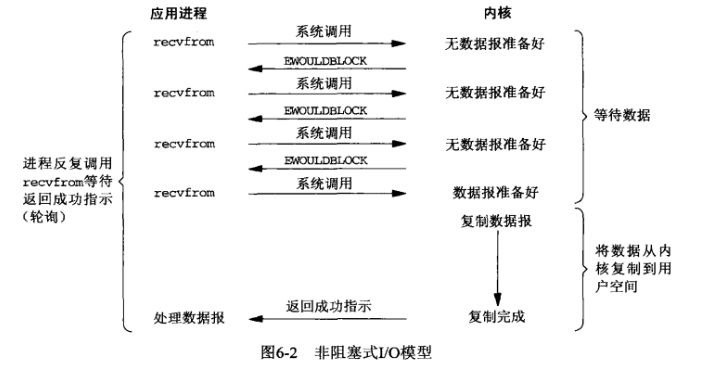

# IO、NIO的理解
  
参考文献 [NIO原理及实例](https://juejin.im/post/5c21ed1bf265da61171cc11b)
## 前置概念 
+ 用户进程、内核进程  
我们平常基于操作系统开发的application应用称之为用户进程，从IO读取数据通常是调用操作系统句柄、函数等，通过内核进程从外部设备读取数据，然后再拷贝到用户进程中的(所以应用层能不能通过某种IO方式进行交互，取决于操作系统本身支不支持这种IO方式)。
+ 阻塞概念和多线程概念的区分
阻塞是指当前进程/线程的操作是否需要等待，针对的是每个进程/线程的行为而言的概念。多线程指的是进程内的每一次执行的单位
+ 同步和异步
同步和异步关注的是进程间**消息通信机制**，简单来说，同步是一种"主动"等待调用结果的方式，异步则相反，调用者不会立刻得到结果，而需要被调用者来回调通知调用者
+ IO常见模型
常见的IO模型有这样几种:阻塞IO、非阻塞IO、多路复用IO、信号驱动IO、异步IO(其中java NIO的IO模型为多路复用IO)  
其中除了异步IO，其它均为同步IO，除开异步IO，其它同步IO的区别在于内核进程从外部设备准备数据的过程中，用户进程是如何和内核进程进行通信的。
其中基础的阻塞IO、非阻塞IO比较简单，直接在用户进程中向内核进程请求获取数据，这时不管内核进程是否将数据准备就绪，用户进程要么被阻塞，要么就在用户进程中轮询内核进程，其中jdk自带的基础IO包即时此实现，直接向内核发起IO请求，如下图
    
多路复用IO则是在上述IO模型的基础上，避免了用户进程等待数据报到内核进程的这个等待时间，在**JDK NIO包**中的体现就是，NIO包允许开发者在用户进程调用操作系统的select指令，去轮询检查IO是否准备就绪，只有准备就绪的IO才会开始进行拷贝操作
   

## NIO是什么
java.nio全称java non-blocking IO，是指jdk1.4 及以上版本里提供的新api（New IO）
为所有的原始类型提供(Buffer)缓存支持。字符集编码解码解决方案。 Channel ：一个新的始I/O 抽象。 支持锁和内存映射文件的文件访问接口。 提供多路(non-blocking) 非阻塞式高伸缩性网络I/O 
根据官方描述可知，NIO实际上就是一个新的一套IO接口，包含了面向缓冲块IO的Buffer、Selector多路复用选择器等组件

### 优势
NIO包提供各种IO相关组件可以适用于IO性能要求更高的场景，如面向缓冲块的Buffer组件，相比传统IO包中面向流的组件，吞吐量更大，传统面向流的IO方式是在用户进程和系统内核进程之间，逐字节的进行读写，代码可读性上可能更加优雅，但是逐字节读写的方式就意味着两个进程间单次交互的数据吞吐量少，而需要交互的次数会更多。面向缓冲块的Buffer组件就是使得两个进程间单次的数据吞吐量增加，从而减少交互的次数，缩减读写完成的时间(代价就是代码实现可能比面向流方式更加复杂)  
多路复用选择器Selector则提供了多路复用IO模型，可以代替传统的在用户进程管理多线程的方式来实现多IO事件的场景

### 细节
关于NIO中各个组件的细节可参考[NIO原理及实例](https://juejin.im/post/5c21ed1bf265da61171cc11b)

