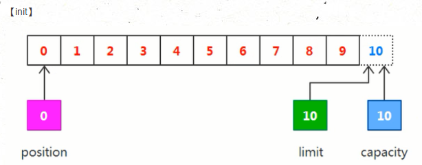
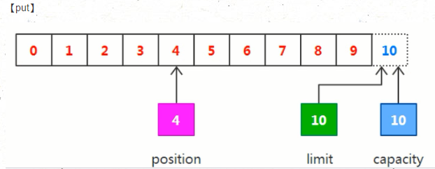
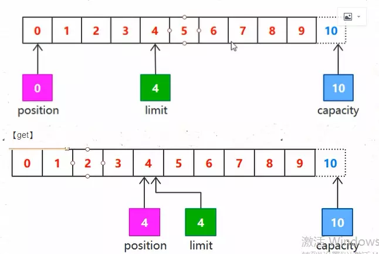

# NIO之Buffer(缓冲区)

## 介绍
本质是一个封装了基本操作的特殊数组，内置了一些机制能追踪和记录缓冲区的状态变化情况，每当对Buffer进行读写时都会引起缓冲区的状态变化(所谓的状态值得就是Buffer中的position、limit、capacity等变量)

## 重要状态
由于NIO的Buffer组件是基于块进行读写的IO组件，所以开发者需要根据当前Buffer内的position、limit、capacity等状态来确定读写数据的具体区域。
1. position  
指定了下一个将要被写入或者读取的元素索引，在新创建一个Buffer对象时，position被初始化为0
2. limit  
操作缓冲区的可操作空间和可操作范围，指定还有多少数据需要去除，或者还有多少空间可以放入数据
3. capacity  
缓冲区数组长度，该Buffer最大数据容量  

大小关系 0<=position<=limit<=capacity

### 基本原理
初始化一个Buffer实例。此时数组的状态如下
  
注意：**块IO的方式下，从通道读取数据，相当于往缓冲区中写入数据**。  
假设此时我们读取四个字节的数据到缓冲区，则Buffer的各个状态如下
  
将想读取的数据写入到缓冲区后，再想写入时需要做两件事：
1. 把limit设置到当前position上  
2. 把position设置为0  
这时Buffer提供的filp()函数做的就是这件事，将刚才读入的数据"固定住"以便写入

  

完成这样的一次读写之后，再执行以下clear()函数使当前这个Buffer回归到初始状态

### 总结
Buffer模块本质是一个数组，定义并维护position、limit、capacity等状态来实现块IO的读写方式，由于基于Buffer的IO方式是读写双向进行的，每次读/写操作开始时，一定要记得flip锁定读取区域；完成后，一定要记得clear重置。这样可以防止读写数据的错乱