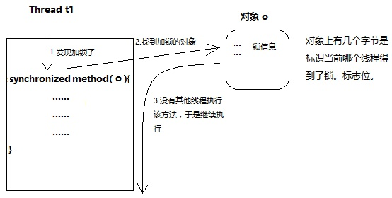
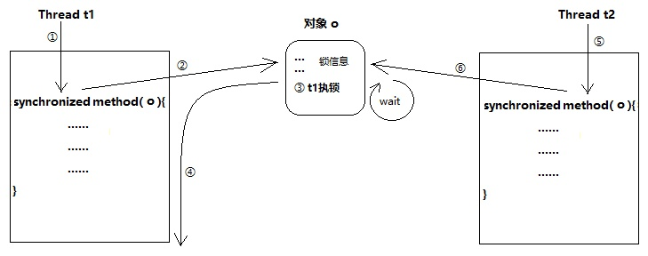

# synchronized锁定的到底是什么？
参考知乎回答 [synchronized锁定的到底是什么？](https://www.zhihu.com/question/57794716?sort=created)

“锁”本身是个对象，synchronized这个关键字不是“锁”,一般就是对象上有几个字节标识当前哪个线程得到了锁的标志位(类似信号量的机制)

所以，所谓的加锁，严格意义上不是锁住代码块,而是标识是否需要进行“读锁”操作

补充几个概念：
+ 互斥的最基本条件是：共用同一把锁
+ 静态方法的锁是所在类的Class对象，普通方法的锁是this对象
+ 针对同一个线程，synchronized锁可以支持重入

所以多个线程间是否互斥，首先看他们是否读的是同一把锁