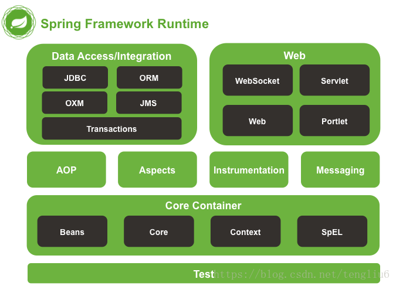

# spring基本介绍
Spring是一个开源框架，Spring是于2003 年兴起的一个轻量级的Java 开发框架，由Rod Johnson 在其著作Expert One-On-One J2EE Development and Design中阐述的部分理念和原型衍生而来。它是为了解决企业应用开发的复杂性而创建的。框架的主要优势之一就是其分层架构，分层架构允许使用者选择使用哪一个组件，同时为 J2EE 应用程序开发提供集成的框架。Spring使用基本的JavaBean来完成以前只可能由EJB完成的事情。然而，Spring的用途不仅限于服务器端的开发。从简单性、可测试性和松耦合的角度而言，任何Java应用都可以从Spring中受益。Spring的核心是控制反转（IoC）和面向切面（AOP）。简单来说，Spring是一个**分层的JavaSE/EE full-stack(一站式) 轻量级开源框架**。

## 基本架构

+ 【Core Container】
    + spring-core: 依赖注入IoC与DI的最基本实现
    + spring-beans: Bean工厂与bean的装配
    + spring-context: spring的context上下文，即IoC容器
    + spring-expression: spring表达式语言

+ 【AOP】
    + spring-aop:面向切面编程
    + spring-aspects: 集成AspectJ
    + spring-instrument: 提供一些类级的工具支持和ClassLoader级的实现，用于服务器
    + spring-instrument-tomcat: 针对tomcat的instrument实现
+ 【data access】
    + spring-jdbc: jdbc的支持
    + spring-tx: 事务控制
    + spring-orm: 对象关系映射，集成orm框架
    + spring-oxm: 对象xml映射
    + spring-jms: java消息服务
+ 【web】
    + spring-web: 基础web功能
    + spring-webmvc: mvc实现
    + spring-webmvc-portlet: 基于portlet的mvc实现
    + spring-websocket：为web应用提供的高效通信工具
    + spring-messaging：用于构建基于消息的应用程序 

## IOC能做什么(接口驱动设计(Interface Driven Design))
IoC 不是一种技术，只是一种思想，一个重要的面向对象编程的法则，它能指导我们如何设计出松耦合、更优良的程序。设计模式六大原则里,依赖倒置原则告诉我们:  
+ 高层模块不应该依赖低层模块，两者都应该依赖其抽象
+ 抽象不应该依赖细节
+ 细节应该依赖抽象
所以spring ioc就是为了这样解耦的一个实现，将组件依赖关系，抽象到Ioc中，使得代码中的具体模块达到解耦效果