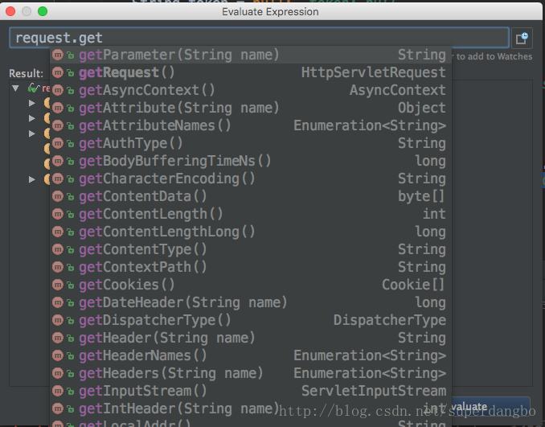

在用IDEA debug调试的时候，当需要动态查看某一个值的时候，就需要用到计算表达式窗口 
当debug选中某一行的时候，按快捷键 Alt + F8 就可以打开Evaluate Expression计算表达式窗口如下：

## 注意
1. Evaluate Expression中代码最好只有一层，如果外面套一层会失效
2. 在debug的时候才会看到这个选项
3. 窗口内的方法可以进行更改，编写